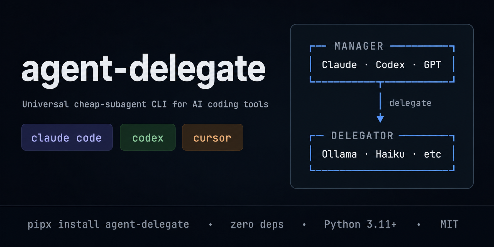

<p align="center">
  
</p>

# agent-delegate

**Route low-reasoning work from Claude Code, Codex, Cursor, and other AI coding agents to a cheap or local LLM — Ollama, LM Studio, OpenRouter, Anthropic Haiku, vLLM, llama.cpp, Groq, or Cerebras.**

[](https://pypi.org/project/agent-delegate/)
[](https://pypi.org/project/agent-delegate/)
[](https://github.com/aliaihub/agent-delegate/actions/workflows/ci.yml)
[](LICENSE)
[](https://github.com/aliaihub/agent-delegate)

Claude Code and Codex burn upstream tokens — and weekly subscription quota — on tasks a local Ollama model handles fine: bulk file reads, boilerplate generation, log summarization, fact extraction. `agent-delegate` is a tiny, zero-dependency CLI that any AI coding tool can shell out to. The cheap model does the busywork; your reasoning-grade context stays clean.

```text
┌─────────────────────┐    delegate ask/write/summarize    ┌──────────────────────┐
│ Claude Code, Codex, │ ────────────────────────────────►  │ Ollama / LM Studio / │
│ Cursor, Aider, etc. │ ◄────────────────────────────────  │ OpenRouter / Haiku   │
└─────────────────────┘            JSON result             └──────────────────────┘
                  ▲                                                  │
                  │       optional JSONL usage log                   │
                  └──────────────────────────────────────────────────┘
```

---

## Main feature: high-reasoning manager, cheap coding workers

`agent-delegate` is designed for a specific operating model:

1. Your expensive reasoning model plans the work, designs the architecture, writes precise specs, reviews output, and explains the result.
2. A cheap/local worker model does bounded execution: bulk reading, boilerplate, tests, scaffolds, summaries, and fact extraction.
3. The manager reports what was delegated, which profile/model handled it, and roughly how much implementation work was delegated.

Check the active worker model before delegating:

```bash
agent-delegate status
agent-delegate profiles show ollama
```

Typical local default:

```text
default profile: ollama
default backend: openai-compat
default model:   qwen3-coder:480b-cloud
default host:    http://localhost:11434/v1
```

For machine-readable manager/worker handoffs, prefer `--json`:

```bash
agent-delegate ask --json --paths src tests --question "which modules need tests?"
agent-delegate write --json --context src tests --spec "draft tests for profile errors" --target tests/test_profiles.py --target-root .
```

After delegating, inspect the worker ledger:

```bash
agent-delegate ledger
agent-delegate ledger --json
```

The ledger reads the usage log and shows each delegated worker call with timestamp, command, profile, backend, model, tokens, duration, target when available, and session id when the parent tool provides one. Use it to support final summaries like:

```text
Delegated implementation: ~70%
Worker model: profile=ollama backend=openai-compat model=qwen3-coder:480b-cloud
Worker calls: ask=1, write=2
```

The installed rule snippets also tell Codex/Claude to show a short visible note when delegation happens:

```text
Delegating to agent-delegate worker: profile=ollama model=qwen3-coder:480b-cloud task="draft profile tests"
```

---

## The manager / delegator pattern

`agent-delegate` splits work between two model tiers — the same way a senior engineer splits work between themselves and a junior:

| Role | Model | What it does |
|---|---|---|
| **Manager** (your AI coding tool) | Claude Opus / Sonnet, GPT-5 / GPT-5-Codex, large reasoning model | Plans architecture. Decides what to build and why. Designs APIs and data models. Reads diffs and reviews delegated output. Catches security gaps. Debugs root causes. Owns the final code. |
| **Delegator** (`agent-delegate`) | Ollama qwen3-coder, kimi-k2.6, Llama 3.3, Anthropic Haiku, Llama on Groq, anything cheap | Executes precise specs the manager wrote. Reads bulk files. Generates boilerplate. Summarizes long output. Extracts facts. Never makes decisions. |

The manager stays in your reasoning-grade tool (Claude Code, Codex, Cursor). Its context window holds only what matters: your intent, the design, and reviewed outputs. The delegator is a one-shot CLI call — fresh context each time, results piped back, no pollution.

### What the manager keeps for itself

- **Architectural decisions** — module layout, dependency choices, API surfaces, data models
- **Security-sensitive code** — auth flows, crypto, secret handling, input validation at trust boundaries
- **Root-cause debugging** — anything needing tight iteration on live signal
- **Migrations and destructive state changes** — anything where rollback is hard
- **Code review** — manager always reviews delegate output before integrating
- **One-line surgical edits** — round-trip cost > benefit
- **The narrative** — explaining decisions to the user

### What the manager delegates

- **Reading 3+ files** to answer a focused question (`agent-delegate ask`)
- **Generating boilerplate** — tests, types, scaffolding, configs, CRUD endpoints, glue code (`agent-delegate write`)
- **Summarizing long output** — logs, transcripts, build output, diffs (`agent-delegate summarize`)
- **Extracting facts** — pulling specific values, identifiers, structure from a corpus (`agent-delegate ask`)

The bundled rule snippets (`agent-delegate install`) inject this split into the manager's system prompt, so Claude Code / Codex automatically know when to shell out.

---

## Why

| Without `agent-delegate` | With `agent-delegate` |
|---|---|
| Claude/Codex reads 8 files just to scaffold one test → ~40k upstream tokens | Local `qwen3-coder` reads those 8 files, returns the test → ~0 upstream tokens |
| Long log summarization eats your 5-hour cap | Cheap model summarizes, only the summary enters upstream context |
| Boilerplate generation burns weekly quota | Free local model writes it; you review |
| Locked to one provider's "weak model" mode (aider, cursor) | Any OpenAI-compatible endpoint, switchable per call |

---

## Install

```bash
pipx install agent-delegate
# or
pip install --user agent-delegate
```

Zero runtime dependencies. Python 3.11+. Works on macOS, Linux, Windows.

---

## Quickstart

```bash
# Answer a question from a corpus of files
agent-delegate ask --paths src/auth.py src/db.py --question "where is the session created?"
agent-delegate ask --paths "src/**/*.py" README.md --question "summarize the public API"
agent-delegate ask --paths src tests --question "which tests cover auth?"
agent-delegate ask --json --paths src --question "which modules define the CLI?"

# Generate a draft file from context + spec
agent-delegate write --context tests/test_users.py \
                     --spec "draft a parallel test suite for the orders table" \
                     --target tests/test_orders.py
agent-delegate write --stdout --context src/agent_delegate/cli.py \
                     --spec "draft argparse help text for the write command"
agent-delegate write --context src tests \
                     --spec "draft tests for profile errors" \
                     --target tests/test_profiles.py \
                     --target-root .

# Summarize anything piped in
tail -n 500 server.log | agent-delegate summarize

# Override profile / model per call
agent-delegate --profile haiku ask --paths README.md --question "..."
agent-delegate --profile openrouter --model meta-llama/llama-3.3-70b-instruct summarize < diff.txt

# Short alias
ad ask --paths README.md --question "what does this CLI do?"
```

---

## One-time setup for AI coding tools

```bash
agent-delegate install
```

Idempotently injects a "delegation policy" rule block into:

| Tool | Target |
|---|---|
| Claude Code (CLI) | `~/.claude/CLAUDE.md` |
| Codex CLI | `~/.codex/AGENTS.md` |
| Claude desktop app | printed snippet for the **Project instructions** UI |
| Codex web app | printed snippet for the **Project instructions** UI |

Each block is bounded by `<!-- agent-delegate:begin vX.Y.Z --> ... <!-- agent-delegate:end -->` markers, so re-running `install` upgrades cleanly and `uninstall` strips the block while preserving everything else.

Preview before writing:

```bash
agent-delegate install --dry-run
agent-delegate install --print claude-desktop   # just dump the snippet
```

---

## Backends

| Backend | Profile | Base URL | Auth |
|---|---|---|---|
| **Ollama** (local + cloud) | `ollama` | `http://localhost:11434/v1` | none |
| **LM Studio** | `lmstudio` | `http://localhost:1234/v1` | none |
| **OpenRouter** | `openrouter` | `https://openrouter.ai/api/v1` | `OPENROUTER_API_KEY` |
| **Anthropic Haiku** | `haiku` | `https://api.anthropic.com/v1` | `ANTHROPIC_API_KEY` |
| **vLLM** | (custom) | configurable | optional |
| **llama.cpp server** | (custom) | `http://localhost:8080/v1` | none |
| **OpenAI / Groq / Cerebras / Together / Fireworks / Hyperbolic** | (custom) | their host | their API key |

Any OpenAI-compatible endpoint works — drop your own profile into `~/.agent-delegate/profiles.toml`. Anthropic native API has its own adapter (`backend = "anthropic"`).

---

## Profiles

`agent-delegate` reads `~/.agent-delegate/profiles.toml`. Write a starter file with the bundled defaults:

```bash
agent-delegate profiles init
```

Example:

```toml
default_profile = "ollama"

[profiles.ollama]
backend = "openai-compat"
base_url = "http://localhost:11434/v1"
default_model = "qwen3-coder:480b-cloud"

[profiles.lmstudio]
backend = "openai-compat"
base_url = "http://localhost:1234/v1"
default_model = "qwen2.5-coder-32b-instruct"

[profiles.openrouter]
backend = "openai-compat"
base_url = "https://openrouter.ai/api/v1"
api_key_env = "OPENROUTER_API_KEY"
default_model = "meta-llama/llama-3.3-70b-instruct"

[profiles.haiku]
backend = "anthropic"
api_key_env = "ANTHROPIC_API_KEY"
default_model = "claude-haiku-4-5"

[profiles.groq]
backend = "openai-compat"
base_url = "https://api.groq.com/openai/v1"
api_key_env = "GROQ_API_KEY"
default_model = "llama-3.3-70b-versatile"
```

Inspect:

```bash
agent-delegate profiles list
agent-delegate profiles show ollama
agent-delegate doctor          # ping each profile + check API keys
```

---

## CLI reference

| Command | What it does |
|---|---|
| `ask` | Answer a question using one or more files as context |
| `write` | Draft a boilerplate file from context + spec; supports `--stdout`, `--target-root`, `--diff`, and fence stripping |
| `summarize` | Condense stdin (logs, transcripts, diffs) |
| `install` | Idempotently inject delegation rules into AI tool configs |
| `uninstall` | Strip injected rule blocks |
| `status` | Show install state + active profile + version |
| `doctor` | Probe each profile for reachability + auth |
| `ledger` | Show recent delegated worker calls and aggregate counts by command/profile/model |
| `profiles list` / `profiles show` / `profiles init` | Manage profiles |

Run `agent-delegate <command> --help` for full flags.

Use `--json` with `ask`, `write`, or `summarize` when another agent will parse the result. JSON success envelopes include `ok`, `command`, `profile`, `model`, `content`, and usage metadata when available. Error envelopes include `ok: false` plus structured error details.

Example success envelope:

```json
{
  "ok": true,
  "command": "ask",
  "profile": "ollama",
  "model": "qwen3-coder:480b-cloud",
  "content": "The CLI entrypoint is src/agent_delegate/cli.py.",
  "usage": {
    "prompt_tokens": 1200,
    "completion_tokens": 80,
    "cached_tokens": 0,
    "reasoning_tokens": 0,
    "total_duration_ms": 1840
  }
}
```

Example error envelope:

```json
{
  "ok": false,
  "command": "write",
  "profile": "ollama",
  "model": "qwen3-coder:480b-cloud",
  "target": "tests/test_profiles.py",
  "error": {
    "type": "target_exists",
    "message": "target exists, pass --force to overwrite: tests/test_profiles.py"
  }
}
```

`ask --paths` and `write --context` accept files, directories, and glob patterns. Directory and glob inputs are expanded in deterministic path order, deduplicated, and skip `.git`, `node_modules`, `dist`, `build`, and `.next` by default. `AGENT_DELEGATE_MAX_FILE_BYTES` limits each file, and `AGENT_DELEGATE_MAX_CORPUS_BYTES` limits the total expanded corpus.

---

## What to delegate — and what NOT to

**Good fits:**
- Reading 3+ files to answer a focused question
- Generating boilerplate (tests, types, scaffolding, configs, CRUD endpoints)
- Summarizing long logs, transcripts, build output, diffs
- Extracting facts or identifiers from a corpus

**Bad fits — keep these in your reasoning model:**
- Secrets, credentials, customer data, PII
- Security decisions, auth flows, crypto
- Root-cause debugging that needs tight iteration
- Database migrations, anything that mutates production
- One-line surgical edits (round-trip cost > benefit)

The bundled rule snippets enforce this split inside Claude Code / Codex.

---

## Optional usage tracking

Set `AGENT_DELEGATE_LOG_DIR=/path/to/dir` to log every delegate call as JSONL. Each record includes timestamp, profile, backend, model, prompt/completion tokens, cwd, and parent process ID. Format is compatible with [token-meter](https://github.com/aliaihub/token-meter) — the companion dashboard for tracking Claude / Codex / delegate token usage.

---

## How it compares

| Tool | What it does | Why agent-delegate is different |
|---|---|---|
| `aider --weak-model` | Aider's cheap-model mode | Aider-only; not callable from Claude Code, Codex, Cursor |
| `cursor delegate` (hypothetical) | Editor-bundled subagent | IDE-locked, single provider |
| `litellm` proxy | Multi-provider proxy | Different layer — `agent-delegate` is the CLI verb your agent calls |
| `agent-delegate` | Universal CLI verb | Any AI tool can shell out; any OpenAI-compatible endpoint or Anthropic; zero deps |

---

## Contributing

PRs welcome. Local dev:

```bash
git clone https://github.com/aliaihub/agent-delegate.git
cd agent-delegate
pip install -e ".[dev]"
pytest
ruff check src tests
```

Keep the package zero-dep (stdlib only) and Python 3.11+ compatible. See [CONTRIBUTING.md](CONTRIBUTING.md).

Security disclosures: see [SECURITY.md](SECURITY.md). Bug reports and feature requests via [issues](https://github.com/aliaihub/agent-delegate/issues).

---

## License

[MIT](LICENSE) © 2026 — see LICENSE for full text.

---

<sub>**Keywords:** ollama CLI, claude code subagent, codex delegate, claude haiku cheap, openrouter cli, llm router, ai coding agent, cost reduction, token budget, quota tracker, LM Studio CLI, vLLM, llama.cpp, prompt cache, multi-backend LLM, local LLM, openai-compatible CLI, claude code rules, codex AGENTS.md, AI tool delegation, agent SDK companion.</sub>
